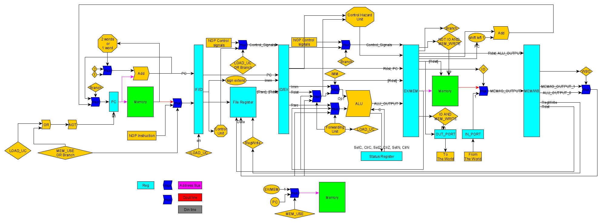

# About

Design of a 5 stage processor

## Assembler

### SETUP

$ pip install -r ./src/assembler/requirements.txt

### Usage

$ python ./assembler compile <in_file> <out_file>

# Block diagram

  

